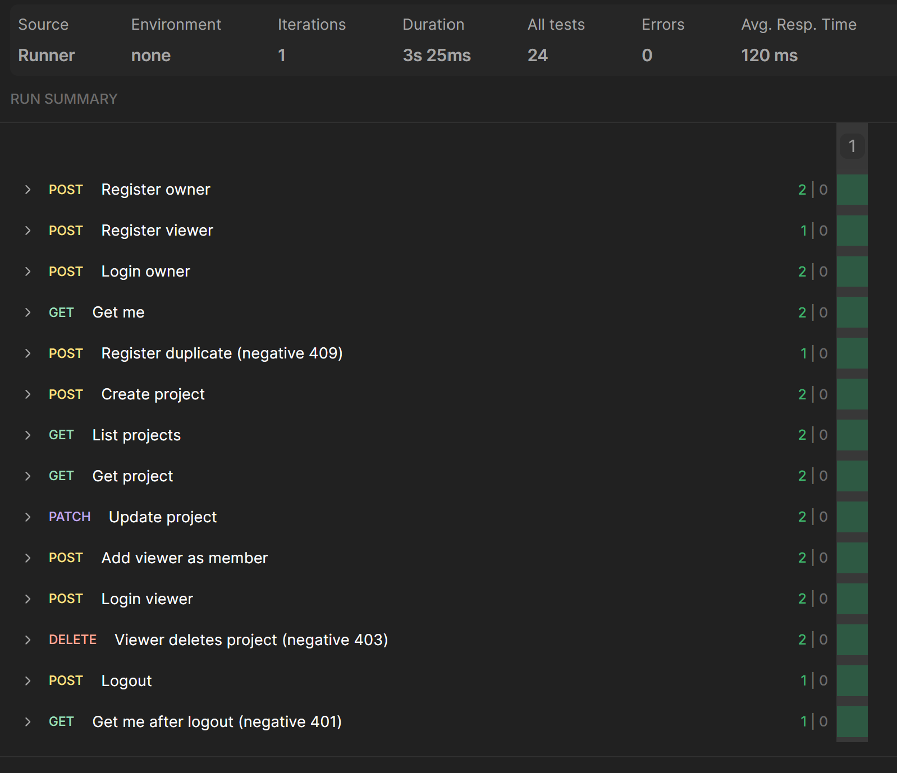

# wavTrace

wavTrace is a full-stack web app for audio review and revision tracking, similar concept to GitHub but designed for team-based audio deliverables instead of software development. A user uploads audio to be reviewed, the reviewer leaves timestamped notes for changes, and the user iterates based on feedback, with differences between iterations tracked using a version history pinned to the notes and feedback from each version.

**Live site:** [https://wavtrace.app](https://wavtrace.app)

## Features

**Demo project** - Every register comes pre loaded with a demo project to explore. Toggle between previous iterations and listen to them, view feedback and comments from reviewers across versions, and compare metadata changes in the diff view.

**Project sharing** - Manage members and share your project with collaborators to leave comments or review your work. Auth uses role-based permissions (owner, reviewer, view-only).

**Pin and region markers** - Reviewers can pin feedback comments at a specific time or highlight a section of the waveform view.

**Versioning** - Tracks the full history of an audio project across iterations, cleanly logging who said what, when, and on which version so changes and feedback are easy to follow over time.

**Waveform visualizations + diff** - Visual waveform display on the timeline and red/green waveform diff view.

**Audio analysis** - Automatically computes (FFmpeg + ffprobe) and displays audio metadata: loudness (LUFS, true peak, LRA), file specs (sample rate, bit depth, duration, format, bitrate), and clipping detection.

**Auto-detected version diff** - Displays changes between versions based on the audio analysis.

**Project search** - Search your projects and projects you've been invited to.


## Getting started (local setup)

### Prerequisites
- Node.js (v20.19 or newer)
- A MongoDB Atlas connection string
- Optional: a Cloudflare account with an R2 bucket (see "Audio storage" below, app runs without it)

### 1. Clone and install

Since this is a monorepo, the `frontend` and `backend` each have their own dependencies.

After cloning the repo:

```bash
# Backend
cd backend
npm install

# Frontend
cd ../frontend
npm install
```

### 2. Backend environment

Create a `.env` file in the `backend` folder:

```bash
MONGO_URI=your-atlas-connection-string
SESSION_SECRET=any-long-random-string
PORT=5000
```

Optional: If you want to run the Newman API tests (see "Testing" below), also add `MONGO_URI_TEST` (same connection string, but with `wavtrace_test` as the database name in the path).

Optional: If you want uploaded audio files to be stored, see "Audio storage (Cloudflare R2)" below. Without it the app still runs and uploads still get analyzed but the files aren't stored.

### 3. Run the app

Two terminals:

```bash
# Terminal 1 - backend (http://localhost:5000)
cd backend
npm run dev

# Terminal 2 - frontend (http://localhost:5173)
cd frontend
npm run dev
```

Open frontend URL shown in the terminal (`http://localhost:5173`) to use the app.

### Optional: Audio storage (Cloudflare R2)

R2 setup is optional. Without it the app still runs and uploads get analyzed with FFmpeg, but the audio file isn't stored after. The pre loaded demo project's audio is unaffected since it is served directly from the backend.

To enable audio upload storage you'll need a Cloudflare account with R2 set up (Cloudflare requires a payment method on file to activate R2 even on the free tier).

> Note: I had issues on their dashboard where it locked me out of my R2 after I already passed the verification.

If you want to set up R2 I'd recommend following their docs:

1. Create a bucket: [R2 getting started](https://developers.cloudflare.com/r2/get-started/)
2. Create an R2 API token with **Object Read & Write** permission scoped to the bucket: [R2 authentication](https://developers.cloudflare.com/r2/api/tokens/). Copy the Access Key ID and Secret Access Key (the secret can't be viewed again).
3. Add a CORS policy on the bucket allowing `GET` and `HEAD` from `http://localhost:5173`: [R2 CORS](https://developers.cloudflare.com/r2/buckets/cors/). Without this the browser blocks playback and the waveform stays blank.

Then add these to `backend/.env` (restart backend after adding):

```bash
R2_ACCOUNT_ID=your-cloudflare-account-id
R2_ACCESS_KEY_ID=from-the-r2-api-token
R2_SECRET_ACCESS_KEY=from-the-r2-api-token
R2_BUCKET=your-bucket-name
STORAGE_ALLOWED_EMAILS=you@example.com
```

`STORAGE_ALLOWED_EMAILS` is a comma-separated allowlist of account emails. Only uploads from these accounts are kept in R2 and everyone else's uploads are analyzed and then discarded. This is the per-account storage safeguard mentioned in "Creating your own project" below.


## Testing

### API tests (Postman/Newman)

An API suite covering auth and project routes, including role-based permission rules. Test data is created and stored in a separate `wavtrace_test` database so the real db doesn't get polluted with dummy data.

#### Coverage
14 requests, 24 assertions:

- **Auth** - register, login, logout, and the session check (`/me`)
- **Projects** - create, list, view, rename, and add members
- **Permissions** - owner-only actions enforced by middleware
- **Negative cases** - 401 (not logged in), 403 (wrong role), 409 (duplicate email)

#### Passing run in Postman (24/24)



#### Running it in Newman CLI (optional)
Two terminals from the `backend` folder:

```bash
# Terminal 1 - server on the test database
npm run dev:test

# Terminal 2 - run the suite
npm run test:api
```

Requires a `MONGO_URI_TEST` value in `backend/.env`: the same Atlas connection string as `MONGO_URI`, but with `wavtrace_test` as the database name in the path.

#### A passing run will look like:

```
┌─────────────────────────┬──────────┬──────────┐
│                         │ executed │   failed │
├─────────────────────────┼──────────┼──────────┤
│              iterations │        1 │        0 │
│                requests │       14 │        0 │
│            test-scripts │       28 │        0 │
│      prerequest-scripts │       14 │        0 │
│              assertions │       24 │        0 │
└─────────────────────────┴──────────┴──────────┘
```


### Unit tests (Mocha/Chai)
*Not completed yet*
- Mostly for the version diff feature since it compares a lot of audio metadata fields between versions. Each field's check has a few possible outcomes and cases like missing data or metadata that's still being processed.

### End-to-end tests (Playwright)
*Not completed yet*
- Final smoke test of main flow.

### CI (if time allows)
*Not completed yet*
- Run the tests on every push with GitHub Actions.


## How to use the app

Register an account and explore the demo project it comes with, or create your own. Upload audio, add iterations, manage members, and share your project with collaborators to leave comments or review your work.

### Demo project example
**Every new registration seeds a personal "Demo Project" ready to explore.** If you just want a quick look, this comes pre-loaded. 

- You can toggle between previous iterations and listen to them, view feedback and comments from reviewers across versions, and compare metadata changes in the diff view.

> *Demo reviewer accounts note: The demo project comes with two demo reviewers. If you clone the repo, they will be created automatically as real user accounts the first time anyone registers, then reused as the reviewers on every new user's demo project. Their password comes from a `DEMO_REVIEWER_PASSWORD` env var, and when the var isn't set the accounts are created with a randomly generated password instead of a hardcoded one.*

### Creating your own project
Upon account creation, audio upload storage is **disabled by default** and needs to be manually enabled per account. This is just a temporary extra safeguard for managing the app's Cloudflare R2 storage usage. For the deployed app, if you want your uploaded audio to be stored and playable, just let me know and I will enable it for the account.

## Tech stack

- **Language:** JavaScript
- **Frontend:** React + Vite, React Router
- **Backend:** Node.js (v24.13.1) + Express
- **Audio analysis:** FFmpeg + ffprobe
- **Waveform:** wavesurfer.js v7
- **Database:** MongoDB Atlas with Mongoose
- **Auth:** Passport (local strategy), express-session, connect-mongo, bcryptjs
- **File storage:** Cloudflare R2
- **Testing:** Postman/Newman (API)


## Future improvements
- Add Mocha/Chai tests and Playwright in addition to Newman.
- Mark a version as "approved" or "final." Locks it from further comments and visually flags it in the version history.
- After being invited as a collaborator, the invited user should be able to accept/deny the invitation instead of having it automatically added to their project list.
- Add change password option and add OAuth option.
- Add contact portal for bugs or support.
- Improve handling of upload restrictions for new accounts and rate limiting.


## Known issues
- Some password manager extensions can temporarily block clicks on the search box, profile icon, and new project button after sign in. Disabling the extension removes the bug.
